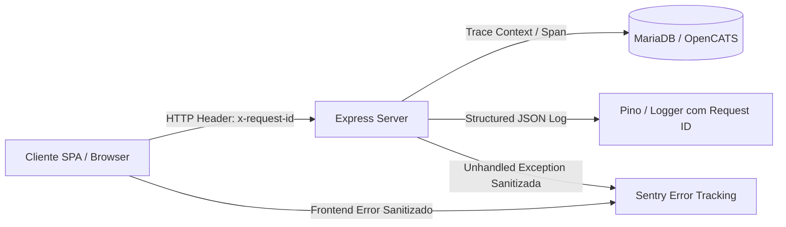
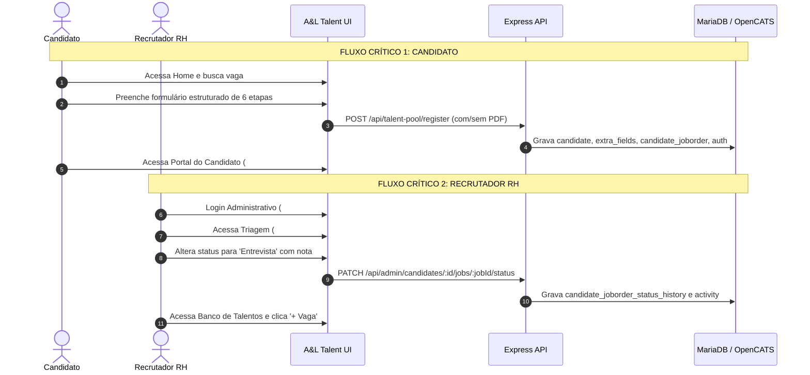
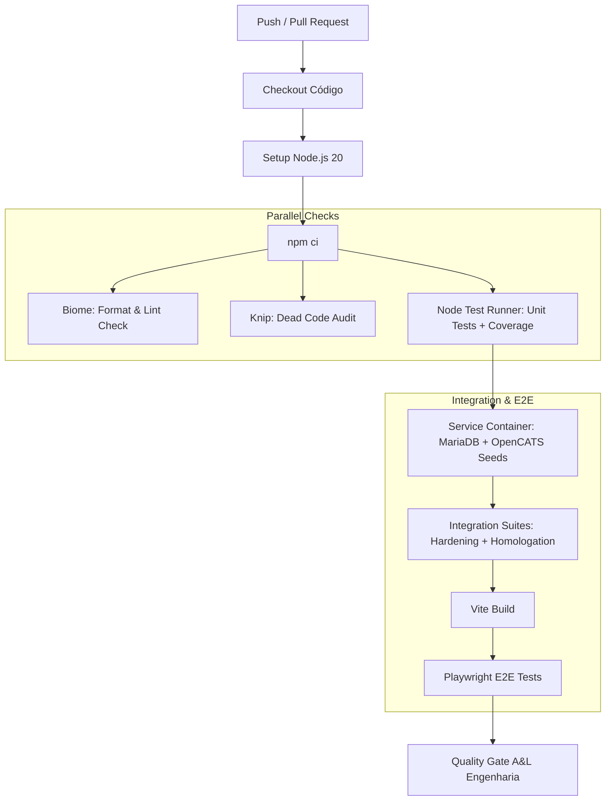

# AUDITORIA DE ENGENHARIA, MOTION, OBSERVABILIDADE, QUALIDADE E TESTES
## PROJETO: A&L TALENT + OPENCATS
**Data da Auditoria:** 18 de Agosto de 2026  
**Versão do Sistema:** A&L Talent v1.0.0 (Vite + Express + MariaDB/OpenCATS)  
**Diretriz Arquitetural:** *A&L Talent por fora, OpenCATS por dentro*

---

# Resumo Executivo

O projeto **A&L Talent** apresenta uma fundação técnica e de segurança sólida, construída para operar como a interface moderna, responsiva e em conformidade com a LGPD sobre a base de dados do ATS **OpenCATS**. As rotas de negócio, autenticação híbrida (Bcrypt para RH, Scrypt timing-safe para Candidatos, tokens HMAC SHA-256 e rate limiting em camadas) foram testadas e demonstraram conformidade nos testes de hardening e homologação operacional.

Entretanto, a auditoria técnica identificou oportunidades claras de elevação da maturidade de engenharia em 4 pilares:
1. **Motion & UX de Carregamento:** A navegação SPA atual utiliza um bloqueador global com spinner em todas as trocas de rota (`appEl.innerHTML = '<div class="page-loader"><div class="spinner"></div></div>'`), resultando em "layout flicker" desnecessário. O uso de *skeletons* é pontual (apenas na busca de vagas da Home e cards de usuários), ausente nas telas de detalhe e painel RH. Não há suporte a `@media (prefers-reduced-motion: reduce)`.
2. **Observabilidade:** O backend depende exclusivamente de `console.log` e `console.error` não estruturados, sem correlação de `request_id`/`trace_id` entre chamadas HTTP e queries MariaDB, e o endpoint `/api/health` é rudimentar.
3. **Qualidade & Governança de Código:** O projeto não possui linter/formatter automatizado configurado no pipeline (como Biome), não possui verificação de código morto (Knip) nem padronização de commits (Commitlint).
4. **Estratégia de Testes & CI:** As suítes existentes (`test_hardening_suite.js`, `test_audit_suite.js`, `test_homologation_suite.js`, `test_recruiter_feature.js`) são testes de integração e segurança altamente eficazes, mas não há separação de testes unitários rápidos isolados de banco, não há testes E2E com navegador real (Playwright), não há medição automatizada de cobertura e **não existe pipeline de CI configurado no repositório (`.github/workflows`)**.

Esta auditoria define o diagnóstico técnico completo, uma matriz de decisão rigorosa e o roadmap pragmático para evolução sem adicionar complexidade desnecessária ou quebrar a arquitetura existente.

---

# Motion Audit

Baseado nos princípios de [design-motion-principles](https://github.com/kylezantos/design-motion-principles), o motion foi classificado com a pergunta norteadora: *"Isso realmente deve se mover?"*

### Classificação de Motion por Tela e Elemento

| Tela / Rota | Elemento | Classificação | Estado Atual | Problema Identificado | Recomendação | Prioridade |
| :--- | :--- | :--- | :--- | :--- | :--- | :--- |
| **Global (SPA)** | Troca de rota (`router.js`) | Excessivo / Inadequado | Injeta `<div class="page-loader"><div class="spinner"></div></div>` em toda navegação | Causa tela branca/flash de carregamento mesmo em páginas estáticas ou rápidas | Remover loader síncrono global; aplicar transição suave ou skeleton direto na view | **P0** |
| **Global (Acessibilidade)** | Todas as animações CSS | Ausente | Animações CSS executadas incondicionalmente | Falta total de respeito à preferência do sistema operacional (`prefers-reduced-motion`) | Implementar `@media (prefers-reduced-motion: reduce)` global | **P0** |
| **Home (`#/`)** | Hero dot (`.hero-dot`) | Decorativo | `pulse 2s ease-in-out infinite` com `scale(1.4)` | Movimento contínuo distrai leitura do título principal | Reduzir para pulsação de opacidade suave (1 para 0.7) sem `scale` ou pausar após 3 ciclos | **P2** |
| **Home (`#/`)** | Cards de estatísticas (`.stats-strip`) | Útil | `fadeUp 400ms` com stagger de até `400ms` de delay | Delay longo adia visualização dos dados para o usuário ao rolar a página | Reduzir delay máximo para `120ms` e distância de deslocamento de `26px` para `10px` | **P2** |
| **Home (`#/`)** | Card de vaga (`.job-card`) | Útil | `transform: translateY(-3px)` e linha de gradiente no hover | Transição limpa e responsiva (150-240ms); boa affordance de clique | Manter; garantir desativação em `reduced-motion` | **P3** |
| **Home (`#/`)** | Dropdown Customizado (`.custom-select`) | Necessário | `dropdownIn 150ms` (`opacity` + `translateY(-6px)`) | Duração curta, suave e não bloqueante | Manter como referência de motion correto | **P3** |
| **Detalhe da Vaga (`#/jobs/:id`)** | Renderização da página | Ausente | Página renderiza após `await getJob()` sem transição | Transição abrupta após o loader global | Entrada suave com `opacity 150ms` | **P2** |
| **Banco de Talentos (`#/talent-pool/register`)** | Mudança de etapas (1 a 6) | Útil | Substituição imediata do DOM da etapa com `scrollTo(0, smooth)` | Transição seca sem feedback direcional entre etapas | Aplicar slide/fade suave curto (180ms) entre passos | **P2** |
| **Portal Candidato (`#/candidato`)** | Alternância de abas | Útil | Troca imediata de DOM sem animação | Transição seca | Fade sutil de 120ms | **P3** |
| **Painel RH (`#/admin/*`)** | Modal Administrativo (`.admin-modal`) | Necessário | `adminModalFadeIn 0.2s` (`scale(0.96) translateY(8px)`) | Suave, foco na tarefa, sem rebote | Manter | **P3** |
| **Painel RH (`#/admin/*`)** | Sidebar Mobile | Necessário | `transform: translateX` (240ms) com backdrop blur | Não bloqueia fluxo e respeita responsividade | Manter | **P3** |
| **Toasts (`.toast`)** | Notificações do sistema | Necessário | `toastIn` (translateX 30px -> 0) e saída via timeout | Notificação perceptível e transitória | Adicionar saída animada antes do unmount no DOM | **P1** |

---

# Skeleton & Loading

### Mapeamento de Estados Assíncronos

| Tela | Operação Assíncrona | Estrutura Previsível? | Estado Atual | Classificação Atual | Recomendação | Prioridade |
| :--- | :--- | :--- | :--- | :--- | :--- | :--- |
| **Home (`#/`)** | Carregamento de vagas | Sim (Grid 3 colunas) | 3 `skeleton-card` com shimmer | **SKELETON** | Manter e padronizar shimmer | **P3** |
| **Home (`#/`)** | Filtros de departamentos | Baixa (Dropdown) | Label padrão até carregar | **PROGRESSIVO** | Manter (popula dinamicamente) | **P3** |
| **Detalhe da Vaga (`#/jobs/:id`)** | Carregamento do detalhe | Sim (Hero + 2 colunas) | Bloqueado pelo router spinner | **SPINNER** | Substituir por Skeleton de Hero + Sidebar | **P1** |
| **Área do Candidato (`#/candidato`)** | `/api/talent-pool/me` | Sim (Header perfil + Cards) | Spinner bloqueante | **SPINNER** | Skeleton estruturado de perfil | **P1** |
| **Dashboard RH (`#/admin`)** | Métricas + 2 tabelas | Sim (4 cards + 2 tabelas) | Spinner bloqueante | **SPINNER** | Skeleton de Metric Cards + Linhas de Tabela | **P1** |
| **Vagas RH (`#/admin/jobs`)** | Lista de vagas | Sim (Tabela tabular) | Spinner bloqueante | **SPINNER** | Skeleton de linhas de tabela (5 placeholders) | **P1** |
| **Candidatos RH (`#/admin/candidates`)** | Triagem / Lista | Sim (Tabela tabular) | Spinner bloqueante | **SPINNER** | Skeleton de linhas de tabela com badge placeholder | **P1** |
| **Banco de Talentos RH (`#/admin/talent-pool`)** | Busca e Filtros | Sim (Tabela tabular) | Spinner bloqueante | **SPINNER** | Skeleton de linhas de tabela | **P1** |
| **Departamentos RH (`#/admin/departments`)** | Lista de Departamentos | Sim (Tabela simples) | Spinner bloqueante | **SPINNER** | Skeleton de 3 linhas de tabela | **P2** |
| **Usuários RH (`#/admin/users`)** | Lista de Recrutadores | Sim (Grid de cards) | 3 `skeleton-card` de 180px | **SKELETON** | Manter | **P3** |
| **Ações de Submit (Forms)** | Salvar/Cadastrar/Candidatar | Não (Ação transitória) | `is-loading` (Spinner no botão) | **SPINNER** | Manter (correto para ações transitórias) | **P3** |

---

# Lazy Loading

### Análise de Bundling do Vite
Atualmente, o arquivo `frontend/src/main.js` realiza a importação estática de **todas as 14 páginas da aplicação**:
```javascript
// frontend/src/main.js - Importações estáticas
import { renderHome } from './pages/Home.js'
import { renderJobDetail } from './pages/JobDetail.js'
import { renderTalentPool } from './pages/TalentPool.js'
import { renderTalentPoolRegister } from './pages/TalentPoolRegister.js'
import { renderCandidatePortal } from './pages/CandidatePortal.js'
import { renderAdminLogin } from './pages/admin/AdminLogin.js'
import { renderAdminDashboard } from './pages/admin/AdminDashboard.js'
import { renderAdminJobs } from './pages/admin/AdminJobs.js'
import { renderAdminJobForm } from './pages/admin/AdminJobForm.js'
import { renderAdminCandidates } from './pages/admin/AdminCandidates.js'
import { renderAdminTalentPool } from './pages/admin/AdminTalentPool.js'
import { renderAdminDepartments } from './pages/admin/AdminDepartments.js'
import { renderAdminUsers } from './pages/admin/AdminUsers.js'
```

### Impacto Identificado:
1. **Bundle Único:** O candidato que acessa a Home pública baixa todo o código JavaScript do Painel Administrativo do RH (`AdminTalentPool.js` com 23KB, `AdminUsers.js`, `AdminJobs.js`, etc.).
2. **Imagens:** Imagens de layout e logos (`logo.png`) não possuem atributo `loading="lazy"` e `decoding="async"`.

### Oportunidade de Otimização:
- **Route-level Code Splitting:** Atualizar o `router.js` para suportar *dynamic imports* (`() => import('./pages/admin/AdminDashboard.js')`), dividindo o build em:
  - `chunk-public.[hash].js` (Home, Jobs, TalentPool, CandidatePortal)
  - `chunk-admin.[hash].js` (Todas as páginas de RH baixadas apenas sob demanda após login)
  - `chunk-vendor.[hash].js` (Código compartilhado)

---

# Accessibility / Reduced Motion

### Diagnóstico de Acessibilidade Motion:
- **Status:** **CRÍTICO / AUSENTE (P0)**
- O seletor `@media (prefers-reduced-motion: reduce)` **não existe** no código CSS atual.
- Usuários com sensibilidade vestibular, epilepsia fotossensível ou preferência de acessibilidade ativa no sistema operacional (Windows/macOS/iOS/Android) continuam recebendo animações de translação, rotação e pulsação contínuas.

### Regra Obrigatória a Implementar:
```css
/* Correção P0 de Acessibilidade de Movimento */
@media (prefers-reduced-motion: reduce) {
  *,
  *::before,
  *::after {
    animation-duration: 0.01ms !important;
    animation-iteration-count: 1 !important;
    transition-duration: 0.01ms !important;
    scroll-behavior: auto !important;
  }
}
```

---

# Observabilidade Atual

### Mapeamento do Estado Atual no Backend e Frontend:
1. **Logs Livres / Desestruturados:**
   - 28 ocorrências de `console.log` e `console.error` dispersas nos controladores.
   - Exemplos reais:
     - `console.error('[/api/jobs] Erro:', err.message)`
     - `console.error('Erro ao cadastrar usuário:', err)`
     - `console.log('[AUTH] Token de recuperação gerado para candidato ID...')`
   - **Problema:** Em caso de erro simultâneo de múltiplos usuários, é impossível rastrear qual requisição HTTP gerou qual falha no banco de dados.
2. **Ausência de Request ID e Trace ID:**
   - Não há correlação entre a requisição iniciada no cliente e a query executada no MariaDB.
3. **Health Check:**
   - Endpoint `/api/health` valida apenas `SELECT 1`. Não reporta uso de memória, pool de conexões MariaDB nem tempo de resposta.
4. **Tratamento de Erros e PII:**
   - O helper `sendError` oculta stack traces em produção (positivo), mas os logs de console não possuem sanitização padronizada contra dados confidenciais.

---

# Observabilidade Recomendada

### Estratégia de Observabilidade Progressiva



1. **Camada 1: Logs Estruturados (Pino ou Logger Nativo JSON)**
   - Substituir `console.log`/`console.error` por logs estruturados contendo:
     - `timestamp` (ISO-8601)
     - `level` (`info`, `warn`, `error`)
     - `request_id` (UUID v4 gerado no middleware)
     - `method`, `route`, `status_code`, `duration_ms`
     - `user_id` / `candidate_id` (quando autenticado)
   - **Regra de Sanitização Estrita:** Nunca incluir senhas, hashes, tokens JWT/HMAC, buffers de currículo ou dados sensíveis nos logs.
2. **Camada 2: Request Correlation ID Middleware**
   - Middleware no Express que atribui `req.id = req.headers['x-request-id'] || crypto.randomUUID()` e devolve no header `x-request-id` da resposta.
3. **Camada 3: OpenTelemetry (Camada Neutra de Telemetria)**
   - Adotar instrumentação OpenTelemetry para Express e MySQL2.
   - Fornece rastreamento distribuído neutro sem acoplamento a vendor proprietário.
4. **Camada 4: Error Tracking (Sentry)**
   - Configuração de Sentry tanto no backend Express quanto no frontend Vite com `beforeSend` para filtragem de PII (sanitização de e-mails de candidatos, CPF/documentos e senhas).

---

# Qualidade Atual

### Diagnóstico de Ferramental e Governança:
- **`package.json` atual:** Contém apenas `concurrently` e `vite` em `devDependencies`.
- **Linting / Formatação:** Ausente (não há ESLint, Prettier ou Biome configurados). A formatação do código depende exclusivamente da configuração do editor de cada desenvolvedor.
- **Detecção de Código Morto:** Não há checagem de exports não utilizados nem dependências obsoletas.
- **Padronização de Commits:** Não há Commitlint ou verificação de Conventional Commits.
- **Contratos Arquiteturais:** As fronteiras arquiteturais estão bem estruturadas na prática (`server/` separado de `src/`), mas sem asserções automatizadas que impeçam regressões (ex: importação acidental de módulos do Node no bundle do browser).

---

# Ferramentas Recomendadas vs Não Necessárias

### Ferramentas Recomendadas (Alto Valor, Baixa Complexidade)

1. **Biome (`@biomejs/biome`) — ADOTAR**
   - *Por que:* Substitui ESLint + Prettier com um único binário ultrarrápido em Rust.
   - *Benefício:* Formatação consistente, regras de lint modernas e ordenação de imports em milissegundos sem complexidade de plugins.
2. **Knip (`knip`) — ADOTAR (como ferramenta de auditoria de CI)**
   - *Por que:* Detecta arquivos não utilizados, dependências não declaradas e exports órfãos sem modificar código automaticamente.
3. **Commitlint (`@commitlint/cli` + `@commitlint/config-conventional`) — ADOTAR**
   - *Por que:* Garante histórico de git padronizado (`feat:`, `fix:`, `docs:`, `test:`, `refactor:`, `chore:`, `security:`) no CI sem travar commits locais desnecessariamente.
4. **Playwright (`@playwright/test`) — ADOTAR**
   - *Por que:* Automação E2E nos navegadores reais para os fluxos críticos de candidato e RH.
5. **OpenTelemetry + Sentry — ADOTAR PROGRESSIVAMENTE**
   - *Por que:* OpenTelemetry garante instrumentação neutra e Sentry garante captura de exceções em tempo real com sanitização de PII.

### Ferramentas Não Necessárias (Rejeitadas com Justificativa)

1. **Datadog / New Relic — NÃO ADOTAR**
   - *Justificativa:* Agentes proprietários pesados, caros e desnecessários para a escala atual da aplicação. OpenTelemetry + Sentry cobrem 100% da necessidade.
2. **ESLint + Prettier combinados — NÃO ADOTAR**
   - *Justificativa:* Configuração duplicada, lenta e propensa a conflitos de regras. O Biome resolve ambos de forma unificada e 20x mais rápida.
3. **TailwindCSS — NÃO ADOTAR**
   - *Justificativa:* O projeto possui Design System próprio robusto em Vanilla CSS (`tokens.css`, `base.css`, `components.css`, `admin.css`) totalmente alinhado à identidade visual institucional da A&L Engenharia.
4. **Stryker Mutation Testing em toda a base — AVALIAR APENAS PARA AUTH CRÍTICA**
   - *Justificativa:* Executar testes de mutação em todo o projeto é computacionalmente proibitivo e adiciona fricção desproporcional. Deve ser restrito estritamente a `server/auth/password.js` e `server/auth/tokens.js`.

---

# Testes Atuais

### Mapeamento das Suítes Existentes

O projeto já conta com um conjunto expressivo de testes automatizados customizados:

| Arquivo de Teste | Tipo | Qtd. Testes | Escopo / Fluxos Cobertos | Dependência de DB |
| :--- | :--- | :--- | :--- | :--- |
| `frontend/test_hardening_suite.js` | Integração & Segurança | 10 | HMAC Timing-Safe, Primeiro Acesso, `/set-password`, Anti-Account Takeover, Anti-Enumeração em `/lookup`, Magic Bytes de Uploads (PDF/DOCX/EXE), Filtros SQL >200 registros, Lockout Força Bruta (423), Single-Use de Token, Rate Limiting por IP (429) | Sim (MariaDB) |
| `frontend/test_audit_suite.js` | Integração & Auditoria | 10 | Deduplicação por e-mail (Case/Trim), Scrypt Auth, Proteção `/me`, Pipeline OpenCATS (candidate_joborder, status_history, activity), Bcrypt Admin Auth, Transição de Pipeline RH, Ocultação de Senha Hash, Security Headers | Sim (MariaDB) |
| `frontend/test_homologation_suite.js` | Homologação E2E de API | 12 | Cadastro sem currículo, Cadastro com PDF/DOCX, Deduplicação, Múltiplas candidaturas, Portal do Candidato (/me, troca senha), Pipeline RH com notas, Busca textual (Datamine/AutoCAD), Ação "+ Vaga", WhatsApp URLs, CRUD de Vagas e Ciclo de Vida, CRUD Departamentos, Recuperação de Senha | Sim (MariaDB) |
| `frontend/test_recruiter_feature.js` | Integração & RBAC | 7 | Criação de Recrutador (access_level 200), Login com detecção de papel, Bloqueio 403 para ações admin, Atribuição de Vagas (`joborder.recruiter`), Bloqueio de exclusão para recrutadores, Escopo de Vagas isolado | Sim (MariaDB) |
| `scripts/test_backup_restore.js` | Operacional / Infra | 4 | Validação de integridade de dumps SQL e restauração de tabelas OpenCATS | Sim (MariaDB) |

**Total Atual:** **43 testes automatizados** cobrindo segurança, RBAC, integridade de dados e conformidade OpenCATS.

---

# Gap de Testes

Apesar da alta cobertura dos fluxos de integração de API e banco de dados, existem lacunas estruturais:

1. **Testes Unitários Puros (Zero DB):**
   - Não há testes unitários rápidos (< 100ms) que rodem sem banco de dados ativo para validar:
     - `helpers.js`: `formatWhatsAppUrl`, `STATUS_MAP`, `formatCandidateProfile`
     - `auth/password.js`: `validatePasswordPolicy`, `hashPassword` / `verifyPassword`
     - `auth/tokens.js`: `signCandidateToken`, `verifyCandidateToken`, `generateResetToken`
     - `upload.js`: `validateUploadedFile` com buffers binários em memória
2. **Testes E2E de Interface (Browser Real com Playwright):**
   - Não há automação que valide a interação do usuário na interface DOM:
     - Formulário em 6 etapas do Banco de Talentos
     - Alternância de abas no Portal do Candidato
     - Modais de triagem e ação "+ Vaga" no Painel do RH
     - Acessibilidade de teclado e foco nos selects customizados
3. **Medição Formal de Cobertura (Coverage):**
   - Os scripts customizados usam `http.request` direto e não geram relatórios LCOV / Istanbul para verificação de branches e linhas cobertas.

---

# E2E com Playwright

### Plano de Implementação Playwright

A automação E2E deve focar estritamente nos **2 fluxos mais críticos de negócio**:



### Casos de Teste Playwright Recomendados:
1. `e2e/candidate-journey.spec.js`:
   - Navegação Home -> Detalhe da vaga -> Inscrição em 6 passos -> Validação de sucesso -> Login no portal do candidato -> Verificação de status.
2. `e2e/recruiter-journey.spec.js`:
   - Login no painel RH -> Criação de vaga -> Visualização de candidatos -> Transição de status no pipeline -> Busca no banco de talentos e vinculação via modal "+ Vaga".
3. `e2e/visual-regression.spec.js` (Seletivo / 4 snapshots essenciais):
   - Snapshot da Home (Hero + Vagas)
   - Snapshot do Detalhe da Vaga
   - Snapshot do Dashboard RH
   - Snapshot do Banco de Talentos

---

# Coverage

### Metas de Cobertura Baseadas em Risco

| Módulo / Camada | Meta Mínima de Linhas | Meta Mínima de Branches | Justificativa |
| :--- | :--- | :--- | :--- |
| **`server/auth/*` (Tokens, Passwords, RateLimit, RBAC)** | **>= 90%** | **>= 85%** | Módulo de maior risco de segurança da aplicação |
| **`server/upload.js` (Magic Bytes & Path Traversal)** | **>= 90%** | **>= 85%** | Proteção contra upload de arquivos maliciosos |
| **`server/helpers.js` (Formatadores e Mapeamentos)** | **>= 85%** | **>= 80%** | Consistência e integridade das respostas |
| **`server/routes/*` (Controladores de API)** | **>= 75%** | **>= 70%** | Cobertura ampla dos fluxos principais |
| **Frontend Utilities & Router** | **>= 70%** | **>= 65%** | Roteamento e manipuladores de token do cliente |

---

# CI/CD

### Pipeline Recomendado (GitHub Actions)

Atualmente **não existe** pipeline de integração contínua configurado no projeto. Propõe-se a criação do workflow `.github/workflows/ci.yml`:



---

# Quality Gate

Para que um Pull Request ou release seja aprovado, deve atender a todos os critérios do **Quality Gate A&L**:

- [ ] **Build:** `npm run build` executa sem erros nem warnings críticos.
- [ ] **Lint & Formatação:** `npx @biomejs/biome check .` passa com 0 erros.
- [ ] **Governança de Código:** `npx knip` sem dependências órfãs ou exports fantasmas.
- [ ] **Testes Unitários:** 100% de aprovação na suíte de testes unitários isolados.
- [ ] **Testes de Integração & Segurança:** 100% de aprovação em `test_hardening_suite.js` e `test_homologation_suite.js`.
- [ ] **Testes RBAC:** 100% de aprovação em `test_recruiter_feature.js`.
- [ ] **E2E:** 100% de aprovação nos fluxos críticos do Playwright.
- [ ] **Cobertura Mínima:** Cobertura de segurança/auth >= 90% e backend geral >= 75%.
- [ ] **Motion Audit:** Zero ocorrências de motion P0 e suporte verificado a `@media (prefers-reduced-motion: reduce)`.
- [ ] **Segurança de PII:** Nenhum dado confidencial (senhas, hashes, tokens, PII) exposto em endpoints públicos ou logs.

---

# Riscos

| Risco Identificado | Severidade | Impacto | Mitigação |
| :--- | :--- | :--- | :--- |
| **Ausência de CI Automatizado** | **Alta** | Regressões podem passar despercebidas se os testes manuais não forem executados antes de commits | Implementar `.github/workflows/ci.yml` imediatamente |
| **Inexistência de `prefers-reduced-motion`** | **Média** | Desconforto ou impedimento para usuários com distúrbios vestibulares | Adicionar regra global de reset no `base.css` (Quick Win) |
| **Logs Não Estruturados sem Request ID** | **Média** | Dificuldade de diagnóstico em produção e correlação de falhas | Implementar middleware de `request_id` e logger estruturado JSON |
| **Acúmulo de Dependências Desnecessárias** | **Média** | Aumento de superfície de ataque e lentidão de build | Seguir a matriz de decisão: rejeitar Datadog, New Relic, ESLint+Prettier duplos |
| **Monólito de Bundle no Frontend** | **Baixa** | Tempo de carregamento inicial marginalmente maior no mobile | Implementar route-level dynamic imports no `router.js` |

---

# Quick Wins

Mudanças de **altíssimo impacto e baixo esforço** identificadas nesta auditoria que podem ser aplicadas sem risco arquitetural:

1. **Quick Win 1 (Acessibilidade P0):** Inserir suporte global a `@media (prefers-reduced-motion: reduce)` em `frontend/src/styles/base.css`.
2. **Quick Win 2 (UX P0):** Substituir o spinner bloqueante global no `router.js` (`appEl.innerHTML = '<div class="page-loader"><div class="spinner"></div></div>'`) por transições suaves diretas por página.
3. **Quick Win 3 (Observabilidade):** Adicionar middleware de `x-request-id` com `crypto.randomUUID()` em `server/index.js` para propagar identificadores únicos de requisição.
4. **Quick Win 4 (Segurança & Observabilidade):** Enriquecer `/api/health` com status de conexões ativas do pool e uptime do processo.
5. **Quick Win 5 (Qualidade):** Configurar `biome.json` na raiz do frontend para padronização instantânea de formatação e linting.

---

# Roadmap de Implementação

### Fase 7.1 — Fundações de Qualidade e Acessibilidade (Sprint 1)
- [ ] Aplicar `@media (prefers-reduced-motion: reduce)` no CSS global.
- [ ] Otimizar transições do router SPA e remover loaders síncronos intrusivos.
- [ ] Configurar Biome (`biome.json`) para formatação e linting automatizado.
- [ ] Configurar `.github/workflows/ci.yml` básico (Build + Biome + Testes Atuais).

### Fase 7.2 — Observabilidade & Resiliência (Sprint 2)
- [ ] Implementar middleware de `request_id` / `trace_id` no Express.
- [ ] Substituir `console.log`/`console.error` livres por logger estruturado com sanitização estrita de PII.
- [ ] Integrar camada neutra OpenTelemetry para rastreamento de spans Express + MariaDB.
- [ ] Configurar Sentry com filtro `beforeSend` para captura de exceções em produção.

### Fase 7.3 — Skeletons & Performance de Carregamento (Sprint 3)
- [ ] Implementar skeletons em todas as telas com estrutura tabular previsível (Admin Dashboard, Vagas, Candidatos, Banco de Talentos).
- [ ] Implementar route-level lazy loading no `router.js` separando chunks públicos e administrativos.
- [ ] Adicionar `loading="lazy"` e `decoding="async"` nas imagens de layout.

### Fase 7.4 — Testes Unitários, Playwright E2E & Quality Gate (Sprint 4)
- [ ] Criar suíte de testes unitários isolados com Node Test Runner / Vitest para helpers, auth e sanitizadores.
- [ ] Implementar os 2 fluxos E2E no Playwright (Candidato e Recrutador RH).
- [ ] Integrar medição de cobertura (Coverage) no GitHub Actions e ativar o Quality Gate A&L completo.

---

# Matriz de Decisão de Ferramentas

| Ferramenta | Problema Resolvido | Já Existe Equivalente? | Valor | Complexidade | Recomendação |
| :--- | :--- | :--- | :--- | :--- | :--- |
| **design-motion-principles** | Guia de boas práticas de motion com propósito | Não formalizado | Alto | Baixa | **ADOTAR** (Como diretriz e checklist de UI) |
| **Biome** | Formatação, lint e ordenação de imports | Não (sem linter atual) | Alto | Baixa | **ADOTAR** (Substitui ESLint + Prettier com 1 binário) |
| **OpenTelemetry** | Tracing e métricas neutras (HTTP + MariaDB) | Não | Alto | Média | **ADOTAR** (Camada neutra de telemetria backend) |
| **Sentry** | Rastreamento de exceções no frontend e backend | Não | Alto | Baixa | **ADOTAR** (Com sanitização rigorosa de PII) |
| **Playwright** | Testes E2E de navegador real nos fluxos críticos | Não (apenas testes de API) | Alto | Média | **ADOTAR** (2 fluxos críticos: Candidato e RH) |
| **Knip** | Detecção de código morto e dependências órfãs | Não | Médio | Baixa | **ADOTAR** (Como auditoria periódica no CI) |
| **Commitlint** | Padronização de mensagens de commit | Não | Médio | Baixa | **ADOTAR** (No CI para Conventional Commits) |
| **Architecture Contracts** | Regras de isolamento entre frontend e server | Estruturado por pastas | Médio | Baixa | **ADOTAR** (Scripts simples no CI) |
| **Stryker** | Testes de mutação para validar qualidade de testes | Não | Médio | Média | **AVALIAR** (Restrito a `password.js` e `tokens.js`) |
| **Codecov** | Visualização de cobertura em PRs | Não | Médio | Baixa | **AVALIAR** (Após estabilização do CI) |
| **Datadog / New Relic** | APM e monitoramento comercial pesado | Suprido por OTel + Sentry | Baixo | Alta | **NÃO NECESSÁRIO** (Custo e complexidade excessivos) |
| **ESLint + Prettier** | Linter e formatador tradicionais | Suprido pelo Biome | Baixo | Média | **NÃO NECESSÁRIO** (Conflitos e lentidão) |

---
*Relatório gerado em conformidade com as diretrizes de governança técnica do projeto A&L Talent.*
